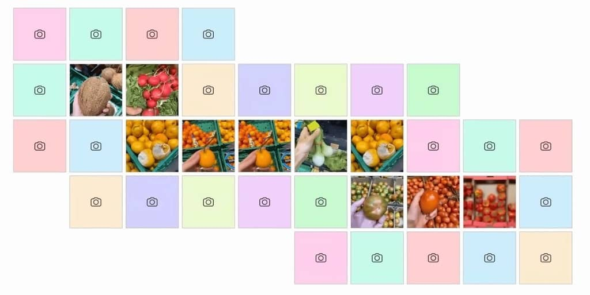

# WTFood: Using AI to uncover the glitchs of the food system 

You feel that something is wrong with the food system, but you still don't know what to do about it.  

## About WTFood

Take a fruit or vegetable, open the camera, and watch it morph into a glitch of the food system. The glitch, is the socioeconomic impact of certain practices, policies or market forces.

### A citizen led, AI assisted analytical map
You are not alone, each tile of the map is a story triggered by someone else. Together, we collaboratively uncover a landscape of systemic glitches and solutions.

# Install instructions

WTFood uses of three main components:

**User interface**:  
The user interface can be run on any device. It is a static website so simply serve the `interface/index.html` file from anywhere. Interface settings can be adjusted in `interface/global_settings.html`

**Backend:**  
The backend handles the call to the different AI components and stores the map info and data. More information can be found in the `backend` folder.

**ComfyUI:**  
This app uses the [ComfyUI](https://github.com/comfyanonymous/ComfyUI) API to simplify workflows for generating the videos. The simplest way to set it up is to use the docker: `docker run wtfood-comfyui`. You can also set up ComfyUI manually and use the `install_comfyui_deps.sh` script in the backend folder.

# Team

Artist: [Bernat Cuní](https://www.cunicode.com/bernat-cuni)  
Developer: [Ruben Gres](https://rubengr.es)

[WTFood](https://wtfood.eu) is part of The [Hungry EcoCities project](https://starts.eu/hungryecocities/), and has received funding from the [European Union’s Horizon Europe research and innovation program under grant agreement 101069990](https://cordis.europa.eu/project/id/101069990). Part of [S+T+ARTS](https://starts.eu/) program.

